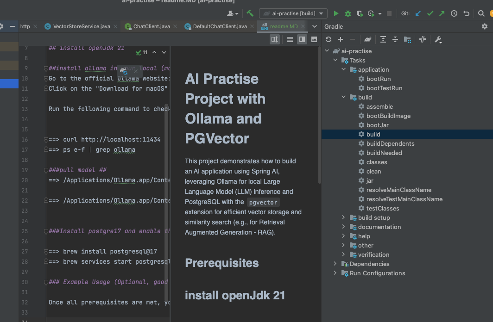
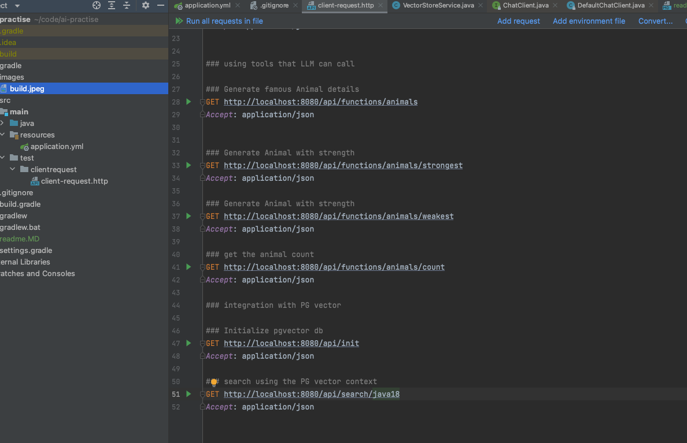

# AI Practise Project with Ollama and PGVector

This project demonstrates how to build an AI application using Spring AI, leveraging Ollama for local Large Language Model (LLM) inference and PostgreSQL with the `pgvector` extension for efficient vector storage and similarity search (e.g., for Retrieval Augmented Generation - RAG).

## Prerequisites

## install openJdk 21

##install ollama in your local (mac)
Go to the official Ollama website: https://ollama.com/download/mac
Click on the "Download for macOS" button and install dmg file 

Run the following command to check if the Ollama server is running:

==> curl http://localhost:11434
==> ps -ef | grep ollama

###pull model ##
==> /Applications/Ollama.app/Contents/Resources/ollama pull nomic-embed-text

==> /Applications/Ollama.app/Contents/Resources/ollama pull llama3.2

###Install postgre17 and enable the vector extension in your database:

==> brew install postgresql@17
==> brew services start postgresql@17

### Execute and Build

Once all prerequisites are met, you can proceed with building and running the application.

compiling and packaging the application
- build 

Run as a Spring Boot application
- bootRun

##Test

### To enable MCP client and server interaction flow.

**Sample MCP server**
git clone https://github.com/mishrarahulranjan/spring-ai-mcp-server
- start SpringAIMCPServerStarter

**enable MCP client app**
Set config as true in application yml.

_spring.ai.mcp.client.enabled = true
spring.ai.mcp.client.toolcallback.enabled = true_

